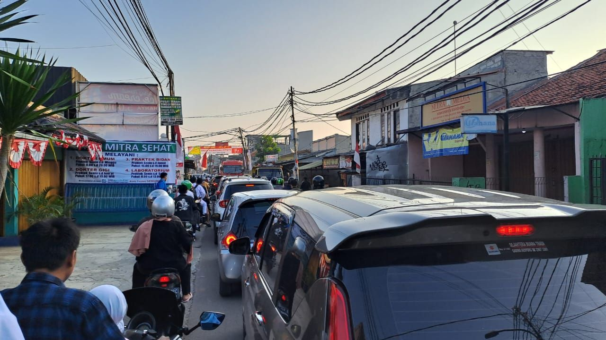

Sudah lama sekali rasanya sejak saya menjadi sukarelawan donor darah rhesus negative. Saya cukup familiar dengan jalan besar dan jalan alternatif menuju PMI Jakarta (Redcross). Biasanya jika ada kebutuhan darah, saya cukup pake motor melahap 32km perjalanan.

Jumat kemarin (19/08/2022) dijadwalkan lagi ke PMI meski kali ini bukan untuk mendonor. Biasanya saya memilih Sabtu, habis shubuh berangkat dari rumah karena jalanan masih kosong dan udara masih segar.

Gak disangka, hari Jum'at pagi macet parah dimulai dari keluar komplek perumahan. Saya coba bertahan, tapi mental saya gak kuat, baru 3km. Putar balik. Foto di atas saya ambil saat saya putuskan untuk pulang saja.

Ini mengingatkan lagi kenapa memilih kerja remote, saya gak bisa lagi "menikmati" kemacetan seperti orang lain. Saya bersyukur, alhamdulillah dapat kerja remote dari mid 2015 hingga sekarang.

Di sisi lain, saya salut untuk rekan-rekan yang bekerja dengan resiko macet-macetan di perjalanan, termasuk orangtua saya dulu sampai masuk usia pensiun. Semoga kita diberi banyak kesabaran oleh Allah.

Saya tidak setuju jika dikatakan "kerja remote lebih baik daripada kerja ke kantor". Sama baiknya, yang penting halal. Masing-masing ada kelebihan dan kekurangannya. Silakan memilih saja mau menjalani yang mana, simple. Apalagi setelah pandemi kemaren, banyak juga perusahaan yang ngasih Remote Work Policy atau Hybrid. Kan makin banyak pilihan.

Selamat menikmati pekerjaan Anda. Have a nice day :)
#remotework

